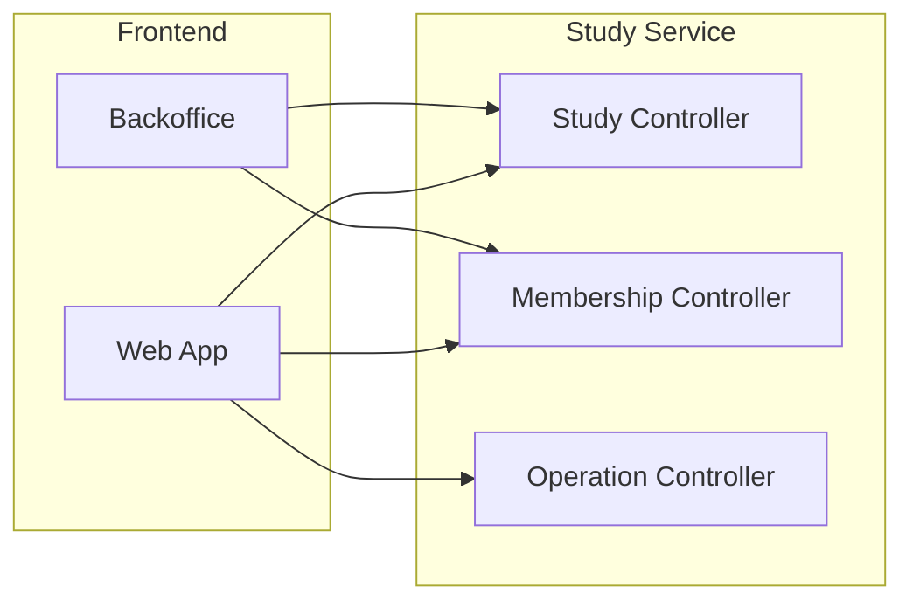
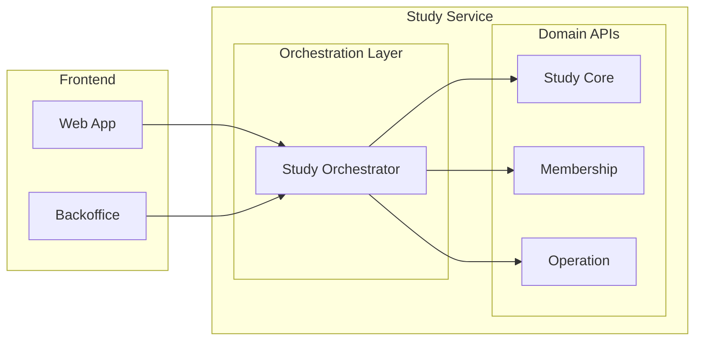
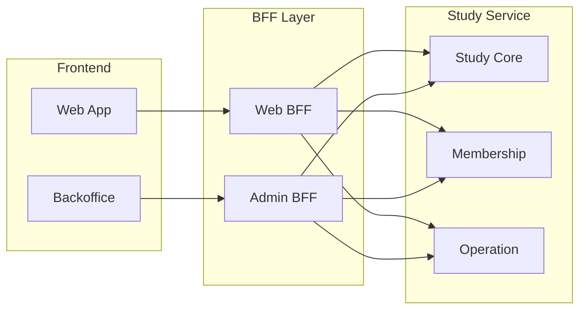
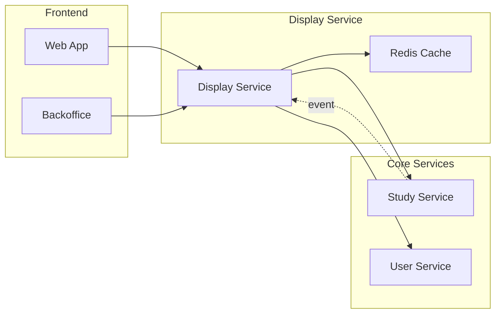

# Study Service 도메인 중심 아키텍처 설계

## 목차
1. [도메인별 패키지 구조 (Domain-First Approach)](#1-도메인별-패키지-구조-domain-first-approach)
2. [프론트엔드 상호작용 패턴 분석](#2-프론트엔드-상호작용-패턴-분석)
3. [도메인 간 통신 패턴](#3-도메인-간-통신-패턴)
4. [확장성 검토](#4-확장성-검토)
5. [최종 권장 아키텍처](#5-최종-권장-아키텍처)
6. [의사결정 가이드라인](#6-의사결정-가이드라인)
7. [구체적 구현 권장사항](#7-구체적-구현-권장사항)
8. [Membership Domain API 설계](#8-membership-domain-api-설계)
9. [Operation Domain API 설계](#9-operation-domain-api-설계)
10. [실제 비즈니스 시나리오](#10-실제-비즈니스-시나리오)

## 1. 도메인별 패키지 구조 (Domain-First Approach)

### 전체 구조
```
study-service/
├── study/                              # Study Core Domain
│   ├── domain/
│   │   ├── model/
│   │   │   ├── Study.java
│   │   │   ├── StudyId.java
│   │   │   ├── StudyLifecycle.java
│   │   │   ├── StudyDetails.java
│   │   │   └── StudyCategory.java
│   │   ├── repository/
│   │   │   └── StudyRepository.java
│   │   └── service/
│   │       └── StudyDomainService.java
│   │
│   ├── application/
│   │   ├── command/
│   │   │   ├── ProposeStudyCommand.java
│   │   │   ├── ApproveStudyCommand.java
│   │   │   └── RejectStudyCommand.java
│   │   ├── query/
│   │   │   ├── StudyDetailQuery.java
│   │   │   └── StudySearchQuery.java
│   │   └── port/
│   │       └── StudyNotificationPort.java
│   │
│   ├── infrastructure/
│   │   ├── persistence/
│   │   │   ├── StudyJpaEntity.java
│   │   │   ├── StudyJpaRepository.java
│   │   │   └── StudyRepositoryAdapter.java
│   │   └── messaging/
│   │       └── StudyEventPublisher.java
│   │
│   └── interfaces/
│       ├── rest/
│       │   ├── StudyController.java
│       │   └── dto/
│       │       ├── StudyRequest.java
│       │       └── StudyResponse.java
│       └── event/
│           └── StudyEventListener.java
│
├── membership/                         # Membership Domain
│   ├── domain/
│   │   ├── model/
│   │   │   ├── Member.java
│   │   │   ├── MemberId.java
│   │   │   ├── Application.java
│   │   │   ├── ApplicationId.java
│   │   │   ├── ApplicationForm.java
│   │   │   └── MemberRole.java
│   │   ├── repository/
│   │   │   ├── MemberRepository.java
│   │   │   └── ApplicationRepository.java
│   │   └── service/
│   │       └── MembershipDomainService.java
│   │
│   ├── application/
│   │   ├── command/
│   │   │   ├── ApplyToStudyCommand.java
│   │   │   ├── AcceptApplicationCommand.java
│   │   │   └── RejectApplicationCommand.java
│   │   ├── query/
│   │   │   ├── MemberListQuery.java
│   │   │   └── ApplicationListQuery.java
│   │   └── port/
│   │       ├── UserInfoPort.java
│   │       └── StudyValidationPort.java
│   │
│   ├── infrastructure/
│   │   ├── persistence/
│   │   │   ├── MemberJpaEntity.java
│   │   │   ├── ApplicationJpaEntity.java
│   │   │   └── MembershipRepositoryAdapter.java
│   │   └── client/
│   │       ├── UserServiceClient.java
│   │       └── StudyServiceAdapter.java
│   │
│   └── interfaces/
│       └── rest/
│           ├── MembershipController.java
│           └── dto/
│               ├── ApplicationRequest.java
│               └── MemberResponse.java
│
├── operation/                          # Operation Domain
│   ├── domain/
│   │   ├── model/
│   │   │   ├── Schedule.java
│   │   │   ├── Assignment.java
│   │   │   ├── Attendance.java
│   │   │   └── StudyResource.java
│   │   ├── repository/
│   │   │   ├── ScheduleRepository.java
│   │   │   └── AttendanceRepository.java
│   │   └── service/
│   │       └── OperationDomainService.java
│   │
│   ├── application/
│   │   ├── command/
│   │   │   ├── CreateScheduleCommand.java
│   │   │   ├── MarkAttendanceCommand.java
│   │   │   └── SubmitAssignmentCommand.java
│   │   └── query/
│   │       ├── ScheduleQuery.java
│   │       └── AttendanceReportQuery.java
│   │
│   ├── infrastructure/
│   │   └── persistence/
│   │       ├── ScheduleJpaEntity.java
│   │       └── OperationRepositoryAdapter.java
│   │
│   └── interfaces/
│       └── rest/
│           └── OperationController.java
│
├── orchestration/                      # 도메인 간 조정 (선택적)
│   ├── StudyLifecycleOrchestrator.java
│   ├── StudyApplicationOrchestrator.java
│   └── dto/
│       └── StudyCreationDto.java
│
└── common/                             # 공통 요소
    ├── domain/
    │   ├── DomainEvent.java
    │   ├── AggregateRoot.java
    │   └── ValueObject.java
    └── infrastructure/
        └── EventBus.java
```

### 도메인 핵심 개념 정의

#### Study Core Domain
```
스터디 도메인의 핵심 개념:

1. Study (스터디 자체)
   - 생명주기: 제안 → 검토 → 승인/반려 → 모집 → 진행 → 종료
   - 메타데이터: 제목, 설명, 카테고리, 태그
   - 운영 정보: 모집 인원, 기간, 장소

2. StudyLifecycle (생명주기 관리)
   - 상태 전이 규칙
   - 각 상태별 가능한 액션
   - 상태 변경 이력
```

#### Membership Domain
```
1. Application (지원)
   - 지원서 작성 → 검토 → 수락/거절
   - 지원서 템플릿 관리
   - 지원 이력 추적

2. Member (멤버)
   - 리더, 일반 멤버 역할
   - 가입/탈퇴 관리
   - 활동 상태 추적
```

#### Operation Domain
```
1. Schedule (일정)
   - 정기/비정기 모임
   - 장소 및 시간 관리
   - 참석 의사 확인

2. Attendance (출석)
   - 출석/결석/지각 관리
   - 출석률 계산
   - 결석 사유 관리

3. Assignment (과제)
   - 과제 생성 및 배포
   - 제출 상태 추적
   - 피드백 관리
```

## 2. 프론트엔드 상호작용 패턴 분석

### 2.1 현재 상황 (BFF/전시 서비스 없음)



**문제점:**
- 프론트엔드가 여러 API를 직접 호출
- 클라이언트 측 복잡도 증가
- 네트워크 오버헤드
- UI별 최적화 어려움

### 2.2 케이스 A: 서비스 내 오케스트레이션 레이어



```java
// orchestration/StudyLifecycleOrchestrator.java
@RestController
@RequestMapping("/api/v1/orchestration/studies")
public class StudyLifecycleOrchestrator {
    
    private final ProposeStudyCommand proposeStudyCommand;
    private final CreateApplicationFormCommand createFormCommand;
    private final StudyQueryService studyQueryService;
    
    @PostMapping
    public StudyCreationResponse createStudyWithDefaults(
            @RequestBody CreateStudyRequest request) {
        
        // 1. 스터디 생성
        StudyId studyId = proposeStudyCommand.execute(
            new ProposeStudyDto(request.getTitle(), request.getDescription())
        );
        
        // 2. 기본 지원서 템플릿 생성
        ApplicationFormId formId = createFormCommand.execute(
            new CreateFormDto(studyId, request.getApplicationQuestions())
        );
        
        // 3. 통합 응답 생성
        return StudyCreationResponse.of(studyId, formId);
    }
    
    @GetMapping("/{studyId}/details")
    public StudyDetailResponse getStudyFullDetails(@PathVariable String studyId) {
        // 여러 도메인에서 데이터 조합
        var study = studyQueryService.findById(studyId);
        var members = membershipQueryService.findByStudyId(studyId);
        var schedule = operationQueryService.findScheduleByStudyId(studyId);
        
        return StudyDetailResponse.builder()
            .study(study)
            .members(members)
            .schedule(schedule)
            .build();
    }
}
```

**장점:**
- 프론트엔드 복잡도 감소
- API 호출 횟수 감소
- 백엔드에서 데이터 조합 최적화

**단점:**
- 서비스 내 결합도 증가
- UI별 맞춤 어려움
- 오케스트레이터가 비대해질 위험

### 2.3 케이스 B: BFF 패턴 도입



```typescript
// web-bff/src/controllers/StudyController.ts
export class StudyController {
    
    async getStudyCard(studyId: string): Promise<StudyCardDto> {
        // Web UI에 최적화된 데이터 구성
        const [study, memberCount, recentActivity] = await Promise.all([
            studyService.getStudy(studyId),
            membershipService.getMemberCount(studyId),
            activityService.getRecent(studyId, 3)
        ]);
        
        return {
            id: study.id,
            title: study.title,
            thumbnail: study.thumbnail || generateThumbnail(study.title),
            memberCount,
            recentActivity: recentActivity.map(a => a.summary),
            tags: extractTags(study)
        };
    }
}

// admin-bff/src/controllers/StudyAdminController.ts
export class StudyAdminController {
    
    async getStudyManagementData(studyId: string): Promise<StudyAdminDto> {
        // 관리자 UI에 필요한 상세 데이터
        const [study, applications, members, reports] = await Promise.all([
            studyService.getStudyWithHistory(studyId),
            membershipService.getPendingApplications(studyId),
            membershipService.getAllMembers(studyId),
            analyticsService.getStudyReports(studyId)
        ]);
        
        return {
            study,
            pendingApplications: applications,
            memberDetails: members,
            analytics: reports,
            auditLog: study.history
        };
    }
}
```

**장점:**
- UI별 최적화 가능
- 프론트엔드 팀 자율성
- 마이크로서비스 간 통신 캡슐화
- GraphQL 도입 용이

**단점:**
- 추가 인프라 필요
- 개발/운영 복잡도 증가
- 데이터 중복 가능성

### 2.4 케이스 C: 전시 서비스 패턴



```java
// display-service/StudyDisplayService.java
@Service
public class StudyDisplayService {
    
    private final RedisTemplate<String, StudyDisplayDto> redisTemplate;
    
    @Cacheable(value = "study-display", key = "#studyId")
    public StudyDisplayDto getStudyDisplay(String studyId) {
        // 캐시 미스 시 데이터 조합
        var display = StudyDisplayDto.builder()
            .basic(studyService.getBasicInfo(studyId))
            .statistics(calculateStatistics(studyId))
            .highlights(generateHighlights(studyId))
            .build();
            
        return display;
    }
    
    @EventListener
    public void handleStudyUpdated(StudyUpdatedEvent event) {
        // 이벤트 기반 캐시 무효화
        evictCache(event.getStudyId());
        // 선택적 사전 캐싱
        preloadCache(event.getStudyId());
    }
}
```

**장점:**
- 읽기 성능 최적화
- 캐싱 전략 중앙화
- 실시간성과 성능 균형

**단점:**
- 데이터 일관성 복잡도
- 캐시 무효화 전략 필요
- 추가 인프라 (Redis 등)

## 3. 도메인 간 통신 패턴

### 3.1 직접 호출 (현재)
```java
// membership/application/command/ApplyToStudyCommand.java
public class ApplyToStudyCommand {
    private final StudyRepository studyRepository; // 직접 의존
    
    public ApplicationId execute(ApplyDto dto) {
        // ❌ 다른 도메인 직접 접근
        Study study = studyRepository.findById(dto.getStudyId())
            .orElseThrow(() -> new StudyNotFoundException());
            
        if (!study.isRecruiting()) {
            throw new StudyNotRecruitingException();
        }
        // ...
    }
}
```

### 3.2 Port를 통한 간접 호출
```java
// membership/application/port/StudyValidationPort.java
public interface StudyValidationPort {
    boolean isStudyRecruiting(StudyId studyId);
    StudyBasicInfo getStudyBasicInfo(StudyId studyId);
}

// membership/application/command/ApplyToStudyCommand.java
public class ApplyToStudyCommand {
    private final StudyValidationPort studyValidation; // Port 통한 의존
    
    public ApplicationId execute(ApplyDto dto) {
        // ✅ Port를 통한 간접 접근
        if (!studyValidation.isStudyRecruiting(dto.getStudyId())) {
            throw new StudyNotRecruitingException();
        }
        // ...
    }
}
```

### 3.3 이벤트 기반 통신
```java
// study/domain/event/StudyApprovedEvent.java
public class StudyApprovedEvent implements DomainEvent {
    private final StudyId studyId;
    private final Instant approvedAt;
    private final UserId approvedBy;
}

// membership/interfaces/event/StudyEventListener.java
@Component
public class StudyEventListener {
    
    @EventListener
    @Async
    public void handleStudyApproved(StudyApprovedEvent event) {
        // 스터디 승인 시 기본 지원서 양식 생성
        createDefaultApplicationForm(event.getStudyId());
    }
}
```

## 4. 확장성 검토

### 4.1 수평적 확장 (기능 추가)

```
현재 구조에서 새 도메인 추가 시:

study-service/
├── study/           (기존)
├── membership/      (기존)
├── operation/       (기존)
├── evaluation/      (신규) - 평가/리뷰 도메인
│   ├── domain/
│   ├── application/
│   ├── infrastructure/
│   └── interfaces/
└── analytics/       (신규) - 분석/통계 도메인
    ├── domain/
    ├── application/
    ├── infrastructure/
    └── interfaces/
```

**장점:**
- 기존 도메인 영향 없이 추가 가능
- 명확한 경계로 팀별 개발 가능
- 점진적 마이그레이션 가능

### 4.2 수직적 확장 (성능/규모)

```java
// CQRS 패턴 적용 예시
// study/application/command/StudyCommandService.java
@Service
@Transactional
public class StudyCommandService {
    private final StudyRepository repository;
    private final EventPublisher eventPublisher;
    
    public StudyId proposeStudy(ProposeStudyDto dto) {
        var study = Study.propose(dto.getTitle(), dto.getDescription());
        repository.save(study);
        eventPublisher.publish(new StudyProposedEvent(study));
        return study.getId();
    }
}

// study/application/query/StudyQueryService.java
@Service
@Transactional(readOnly = true)
public class StudyQueryService {
    private final StudyReadModelRepository readRepository;
    
    @Cacheable("study-list")
    public Page<StudyListView> searchStudies(SearchCriteria criteria) {
        // 읽기 최적화된 모델 사용
        return readRepository.search(criteria);
    }
}
```

## 5. 최종 권장 아키텍처

### 5.1 단계별 진화 전략

**Phase 1: 모놀리식 + 도메인 분리 (현재)**
```
study-service/
├── study/
├── membership/
├── operation/
└── orchestration/ (선택적)
```

**Phase 2: BFF 도입 (6개월 후)**
```
Frontend → BFF → Study Service
              → User Service
              → Notification Service
```

**Phase 3: 마이크로서비스 분리 (1년 후)**
```
study-core-service/
membership-service/
operation-service/
```

### 5.2 현재 시점 권장사항

```java
// 1. 도메인 간 통신은 Port/Adapter 패턴
public interface StudyValidationPort {
    StudyStatus getStudyStatus(StudyId studyId);
}

// 2. 복잡한 조회는 전용 Query Service
@Service
public class StudyDisplayQueryService {
    public StudyDetailView getStudyDetail(StudyId id) {
        // JOIN 쿼리로 한 번에 조회
    }
}

// 3. 이벤트 기반 일관성
@TransactionalEventListener(phase = TransactionPhase.AFTER_COMMIT)
public void handleStudyApproved(StudyApprovedEvent event) {
    // 트랜잭션 커밋 후 처리
}
```

## 6. 의사결정 가이드라인

### 6.1 오케스트레이션 레이어가 필요한 경우:
- ✅ 3개 이상 도메인 조합 필요
- ✅ 복잡한 트랜잭션 조정
- ✅ UI별 다른 데이터 조합
- ❌ 단순 CRUD 작업
- ❌ 단일 도메인 작업

### 6.2 BFF가 필요한 경우:
- ✅ 다양한 클라이언트 (Web, Mobile, Admin)
- ✅ GraphQL 도입 계획
- ✅ 프론트엔드 팀 독립성 중요
- ❌ 단일 웹 클라이언트만 존재
- ❌ 개발 리소스 부족

### 6.3 전시 서비스가 필요한 경우:
- ✅ 대용량 읽기 트래픽
- ✅ 복잡한 데이터 조합 + 캐싱
- ✅ 실시간성보다 성능 우선
- ❌ 실시간 데이터 중요
- ❌ 단순한 데이터 구조

## 7. 구체적 구현 권장사항

### 7.1 현재 구조 개선
```java
// common/domain/AggregateRoot.java
public abstract class AggregateRoot {
    private final List<DomainEvent> events = new ArrayList<>();
    
    protected void raiseEvent(DomainEvent event) {
        events.add(event);
    }
    
    public List<DomainEvent> getEvents() {
        return Collections.unmodifiableList(events);
    }
}

// study/domain/model/Study.java
public class Study extends AggregateRoot {
    // ... 기존 필드
    
    public void approve(UserId approverId) {
        validatePendingStatus();
        this.lifecycle = lifecycle.approve(approverId);
        raiseEvent(new StudyApprovedEvent(this.id, approverId));
    }
}
```

### 7.2 API 설계 원칙
```java
// 리소스 중심이 아닌 작업 중심 API
@PostMapping("/studies/{id}/approval")  // ✅ 명확한 의도
public ResponseEntity<Void> approveStudy(@PathVariable StudyId id) {
    approveStudyCommand.execute(id);
    return ResponseEntity.ok().build();
}

// NOT
@PutMapping("/studies/{id}")  // ❌ 모호한 의도
public ResponseEntity<Void> updateStudy(@PathVariable StudyId id, 
                                       @RequestBody StudyDto dto) {
}
```

### 7.3 테스트 전략
```java
// 도메인 단위 테스트
class StudyTest {
    @Test
    void 승인시_상태가_변경되고_이벤트가_발생한다() {
        // Given
        var study = Study.propose("title", "desc", UserId.of("proposer"));
        
        // When
        study.approve(UserId.of("approver"));
        
        // Then
        assertThat(study.getStatus()).isEqualTo(StudyStatus.APPROVED);
        assertThat(study.getEvents()).hasSize(1);
        assertThat(study.getEvents().get(0))
            .isInstanceOf(StudyApprovedEvent.class);
    }
}
```

### 7.4 도메인 엔티티와 영속성 엔티티 분리

#### 도메인 엔티티 (순수 비즈니스 로직)
```java
// domain/study/Study.java
public class Study {
    private final StudyId id;
    private final String title;
    private final String description;
    private final UserId proposerId;
    private StudyLifecycle lifecycle;
    private final Set<StudyMember> members;
    
    // 팩토리 메서드
    public static Study propose(String title, String description, UserId proposerId) {
        return new Study(
            StudyId.generate(),
            title,
            description,
            proposerId,
            StudyLifecycle.initial(),
            new HashSet<>()
        );
    }
    
    // 비즈니스 메서드
    public void approve(UserId approverId) {
        lifecycle = lifecycle.approve(approverId);
    }
    
    public void reject(UserId reviewerId, String reason) {
        lifecycle = lifecycle.reject(reviewerId, reason);
    }
    
    // 상태 검증
    public boolean canAcceptApplications() {
        return lifecycle.isInRecruitment() && !isFull();
    }
}
```

#### 영속성 엔티티 (JPA)
```java
// infrastructure/persistence/study/StudyJpaEntity.java
@Entity
@Table(name = "studies")
public class StudyJpaEntity {
    @Id
    private String id;
    
    @Column(nullable = false)
    private String title;
    
    @Column(columnDefinition = "TEXT")
    private String description;
    
    @Column(name = "proposer_id", nullable = false)
    private String proposerId;
    
    @Enumerated(EnumType.STRING)
    private String status;
    
    private LocalDateTime createdAt;
    private LocalDateTime updatedAt;
    
    // Getters and Setters (순수 데이터 홀더)
}
```

#### 매퍼를 통한 변환
```java
// infrastructure/persistence/study/StudyMapper.java
@Component
public class StudyMapper {
    
    public Study toDomain(StudyJpaEntity entity) {
        return new Study(
            new StudyId(entity.getId()),
            entity.getTitle(),
            entity.getDescription(),
            new UserId(entity.getProposerId()),
            mapLifecycle(entity),
            loadMembers(entity.getId())
        );
    }
    
    public StudyJpaEntity toEntity(Study domain) {
        var entity = new StudyJpaEntity();
        entity.setId(domain.getId().getValue());
        entity.setTitle(domain.getTitle());
        entity.setDescription(domain.getDescription());
        entity.setProposerId(domain.getProposerId().getValue());
        entity.setStatus(domain.getLifecycle().getStatus().name());
        return entity;
    }
}
```

### 7.5 기존 코드 재배치 계획

```
현재 코드 위치 → 새로운 위치:

1. domain/model/Study.java 
   → domain/study/Study.java (도메인 로직 분리)
   → infrastructure/persistence/study/StudyJpaEntity.java (영속성 관심사)

2. domain/model/StudyStatus.java 
   → domain/study/StudyStatus.java (그대로 유지)

3. domain/service/StudyService.java 
   → application/study/command/* (유스케이스별로 분리)
     - createStudy() → ProposeStudyUseCase
     - approveStudy() → ApproveStudyUseCase  
     - rejectStudy() → RejectStudyUseCase
     - terminateStudy() → TerminateStudyUseCase

4. domain/port/in/StudyUseCase.java 
   → 삭제 (유스케이스별 인터페이스로 대체)

5. domain/port/out/StudyRepository.java
   → domain/study/StudyRepository.java (도메인 인터페이스)

6. domain/port/out/NotificationPort.java
   → application/port/NotificationPort.java (애플리케이션 포트)

7. adapter/out/persistence/InMemoryStudyRepository.java
   → infrastructure/persistence/study/StudyRepositoryAdapter.java

8. adapter/in/web/StudyController.java
   → interfaces/rest/study/StudyController.java

9. application/service/StudyUseCaseImpl.java
   → 삭제 (개별 유스케이스로 분리)
```

### 7.6 실용적 설계 원칙

#### 단순하게 시작하기
```java
// 복잡한 설계 피하기
❌ public class StudyAggregate extends BaseAggregate<StudyId> 
    implements EventSourcedAggregate<StudyEvent> {
    // 과도한 추상화
}

// 명확하고 단순하게
✅ public class Study {
    private final StudyId id;
    private StudyStatus status;
    
    public void approve() {
        if (status != StudyStatus.PENDING) {
            throw new IllegalStateException("승인할 수 없는 상태입니다");
        }
        this.status = StudyStatus.APPROVED;
    }
}
```

#### 연관관계는 ID로만
```java
// JPA 연관관계 매핑 사용 안함
❌ @ManyToMany
   private Set<User> members;

// ID 참조만 사용
✅ private Set<UserId> memberIds;
```

#### 읽기/쓰기 분리
```java
// Command용 (도메인 모델 사용)
public class ProposeStudyUseCase {
    public StudyId execute(ProposeStudyCommand command) {
        var study = Study.propose(
            command.getTitle(),
            command.getDescription(),
            command.getProposerId()
        );
        studyRepository.save(study);
        return study.getId();
    }
}

// Query용 (DTO 직접 조회)
public class StudyQueryService {
    @Transactional(readOnly = true)
    public Page<StudyListDto> findStudies(Pageable pageable) {
        return studyJpaRepository.findApprovedStudies(pageable);
    }
}
```

## 8. Membership Domain API 설계

### 8.1 일반 회원용 API

#### 스터디 지원 관련
```
POST   /api/v1/studies/{studyId}/applications      # 스터디 지원
GET    /api/v1/studies/{studyId}/application-form  # 지원서 양식 조회
GET    /api/v1/my/applications                     # 내 지원 현황
DELETE /api/v1/applications/{applicationId}        # 지원 취소
PUT    /api/v1/applications/{applicationId}        # 지원서 수정
```

**비즈니스 필요성:**
- 크루들이 관심있는 스터디에 지원하는 핵심 기능
- 지원 상태 추적으로 불안감 해소
- 지원서 수정으로 실수 정정 기회 제공

#### 스터디 멤버 활동
```
GET    /api/v1/my/studies                         # 내가 참여중인 스터디
GET    /api/v1/studies/{studyId}/members          # 스터디 멤버 목록
POST   /api/v1/studies/{studyId}/leave            # 스터디 탈퇴
GET    /api/v1/studies/{studyId}/my-role          # 내 역할 확인
```

**비즈니스 필요성:**
- 멤버 간 네트워킹 촉진
- 스터디 참여 현황 파악
- 자발적 탈퇴로 강제성 완화

### 8.2 스터디 리더용 API

#### 지원자 관리
```
GET    /api/v1/studies/{studyId}/applications           # 지원자 목록
GET    /api/v1/applications/{applicationId}/details     # 지원서 상세
POST   /api/v1/applications/{applicationId}/accept      # 지원 승인
POST   /api/v1/applications/{applicationId}/reject      # 지원 거절
POST   /api/v1/studies/{studyId}/applications/bulk-accept # 일괄 승인
```

**비즈니스 필요성:**
- 리더의 자율적 멤버 선발권 보장
- 스터디 품질 관리
- 효율적인 대량 처리

#### 멤버 관리
```
POST   /api/v1/studies/{studyId}/members/{memberId}/role     # 역할 변경
DELETE /api/v1/studies/{studyId}/members/{memberId}          # 멤버 제명
POST   /api/v1/studies/{studyId}/members/{memberId}/warning  # 경고 발송
GET    /api/v1/studies/{studyId}/members/statistics          # 멤버 통계
```

**비즈니스 필요성:**
- 부리더 임명으로 운영 부담 분산
- 문제 멤버 관리로 스터디 분위기 보호
- 데이터 기반 운영 의사결정

### 8.3 관리자용 API

```
GET    /api/v1/admin/applications?status=pending&days=7    # 장기 미처리 지원
GET    /api/v1/admin/members/inactive?days=30             # 비활성 멤버
POST   /api/v1/admin/studies/{studyId}/members/reset      # 멤버 초기화
GET    /api/v1/admin/reports/member-churn                 # 이탈률 리포트
```

**비즈니스 필요성:**
- 방치된 지원서로 인한 부정적 경험 방지
- 좀비 스터디 방지
- 플랫폼 건전성 지표 관리

## 9. Operation Domain API 설계

### 9.1 일반 멤버용 API

#### 출석 관리
```
POST   /api/v1/studies/{studyId}/attendance/check-in     # 출석 체크
GET    /api/v1/studies/{studyId}/my/attendance          # 내 출석 현황
GET    /api/v1/studies/{studyId}/attendance/today       # 오늘 출석 현황
POST   /api/v1/attendance/{attendanceId}/excuse         # 결석 사유 제출
```

**비즈니스 필요성:**
- 성실한 참여 문화 조성
- 개인 참여도 가시화
- 정당한 결석 인정으로 유연성 제공

#### 일정 관리
```
GET    /api/v1/studies/{studyId}/schedules              # 스터디 일정
GET    /api/v1/my/schedules                            # 내 전체 일정
POST   /api/v1/schedules/{scheduleId}/rsvp             # 참석 의사 표시
GET    /api/v1/studies/{studyId}/schedules/next        # 다음 모임 정보
```

**비즈니스 필요성:**
- 멤버들의 시간 관리 지원
- 참석 예상 인원 파악
- 일정 충돌 방지

#### 과제/자료 관리
```
GET    /api/v1/studies/{studyId}/assignments           # 과제 목록
POST   /api/v1/assignments/{assignmentId}/submit       # 과제 제출
GET    /api/v1/assignments/{assignmentId}/submissions  # 제출 현황
GET    /api/v1/studies/{studyId}/resources            # 학습 자료
POST   /api/v1/resources/{resourceId}/bookmark        # 자료 북마크
```

**비즈니스 필요성:**
- 학습 진도 관리
- 동료 학습 촉진
- 유용한 자료 공유 문화

### 9.2 스터디 리더용 API

#### 일정 생성/관리
```
POST   /api/v1/studies/{studyId}/schedules            # 일정 생성
PUT    /api/v1/schedules/{scheduleId}                # 일정 수정
DELETE /api/v1/schedules/{scheduleId}                # 일정 취소
POST   /api/v1/schedules/{scheduleId}/notify         # 일정 알림
POST   /api/v1/studies/{studyId}/schedules/recurring # 반복 일정 생성
```

**비즈니스 필요성:**
- 규칙적인 학습 리듬 형성
- 긴급 변경사항 즉시 전파
- 자동화로 운영 부담 경감

#### 출석/과제 관리
```
GET    /api/v1/studies/{studyId}/attendance/report      # 출석 리포트
POST   /api/v1/studies/{studyId}/attendance/rules      # 출석 규칙 설정
POST   /api/v1/studies/{studyId}/assignments           # 과제 생성
GET    /api/v1/assignments/{id}/submissions/status     # 제출 현황
POST   /api/v1/assignments/{id}/feedback/{submissionId} # 피드백 작성
```

**비즈니스 필요성:**
- 데이터 기반 멤버 관리
- 맞춤형 운영 정책 수립
- 양질의 피드백으로 학습 효과 증대

#### 운영 도구
```
POST   /api/v1/studies/{studyId}/announcements         # 공지사항
GET    /api/v1/studies/{studyId}/operation/dashboard   # 운영 대시보드
POST   /api/v1/studies/{studyId}/operation/export     # 데이터 내보내기
GET    /api/v1/studies/{studyId}/operation/insights   # 운영 인사이트
```

**비즈니스 필요성:**
- 중요 정보의 확실한 전달
- 한눈에 보는 스터디 현황
- 외부 도구 연동 지원

### 9.3 플랫폼 관리자용 API

```
GET    /api/v1/admin/operations/low-attendance         # 저조한 출석률 스터디
GET    /api/v1/admin/operations/inactive-studies      # 비활성 스터디
POST   /api/v1/admin/operations/health-check          # 스터디 건강도 점검
GET    /api/v1/admin/operations/best-practices       # 우수 운영 사례
```

**비즈니스 필요성:**
- 문제 스터디 조기 발견
- 플랫폼 품질 관리
- 우수 사례 발굴 및 전파

## 10. 실제 비즈니스 시나리오

### 시나리오 1: 스터디 지원부터 활동까지
```
1. 철수가 "React 심화 스터디" 발견
   → GET /api/v1/studies/{studyId}/application-form
   
2. 지원서 작성 및 제출
   → POST /api/v1/studies/{studyId}/applications
   
3. 리더가 지원서 검토
   → GET /api/v1/studies/{studyId}/applications
   → GET /api/v1/applications/{applicationId}/details
   
4. 지원 승인
   → POST /api/v1/applications/{applicationId}/accept
   
5. 첫 모임 출석
   → GET /api/v1/studies/{studyId}/schedules/next
   → POST /api/v1/studies/{studyId}/attendance/check-in
   
6. 과제 제출
   → GET /api/v1/studies/{studyId}/assignments
   → POST /api/v1/assignments/{assignmentId}/submit
```

### 시나리오 2: 스터디 운영 관리
```
1. 리더가 월간 출석 현황 확인
   → GET /api/v1/studies/{studyId}/attendance/report
   
2. 출석률 80% 미만 멤버 발견
   → POST /api/v1/studies/{studyId}/members/{memberId}/warning
   
3. 다음 달 일정 일괄 생성
   → POST /api/v1/studies/{studyId}/schedules/recurring
   
4. 중요 공지사항 발송
   → POST /api/v1/studies/{studyId}/announcements
```

## 11. API 우선순위 및 MVP

### Phase 1 (MVP - 3주)
```
Membership:
- 스터디 지원/취소
- 지원 승인/거절
- 멤버 목록 조회

Operation:
- 기본 일정 CRUD
- 출석 체크인
- 공지사항
```

### Phase 2 (핵심 기능 - 4주)
```
Membership:
- 지원서 템플릿
- 역할 관리
- 멤버 통계

Operation:
- 과제 관리
- 출석 리포트
- 반복 일정
```

### Phase 3 (고급 기능 - 3주)
```
Membership:
- 일괄 처리
- 멤버 제재
- 추천 시스템

Operation:
- 운영 대시보드
- 자동 알림
- 데이터 분석
```

## 12. 핵심 비즈니스 가치

1. **참여율 향상**: 체계적인 출석/과제 관리로 적극적 참여 유도
2. **운영 효율화**: 자동화 도구로 리더 부담 경감
3. **품질 관리**: 데이터 기반 의사결정으로 스터디 품질 향상
4. **사용자 만족**: 투명한 프로세스로 신뢰도 증가
5. **네트워크 효과**: 활발한 상호작용으로 커뮤니티 활성화

## 13. 멀티모듈 전환 고려사항

### 현재: 모놀리식 패키지 구조
```
study-service/
└── src/main/java/com/asyncsite/studyservice/
    ├── domain/
    ├── application/
    ├── infrastructure/
    └── interfaces/
```

### 향후: 멀티모듈 구조 (필요시)
```
study-service/
├── study-domain/        # 순수 도메인 (의존성 없음)
├── study-application/   # 유스케이스 (domain 의존)
├── study-infrastructure/# 기술 구현 (application, domain 의존)
├── study-interfaces/    # API (application 의존)
└── study-bootstrap/     # 스프링 부트 앱 (모든 모듈 의존)
```

## 14. 핵심 설계 결정사항

1. **도메인 순수성**: 도메인 레이어는 프레임워크 의존성 없음
2. **명시적 경계**: 각 컨텍스트는 명확한 책임과 경계 보유
3. **ID 참조**: 애그리거트 간 참조는 ID로만
4. **이벤트 기반**: 컨텍스트 간 통신은 이벤트 활용
5. **CQRS 경량화**: 복잡한 쿼리는 별도 서비스로 분리
6. **점진적 개선**: 모놀리식으로 시작, 필요시 모듈 분리

이 설계를 통해 도메인의 복잡성을 관리하면서도 과도한 추상화를 피하고, 실용적이고 유지보수 가능한 구조를 만들 수 있습니다.

이러한 API들은 단순히 기능을 제공하는 것이 아니라, 스터디 플랫폼의 핵심 가치인 "함께 성장하는 학습 문화"를 기술적으로 구현하는 수단입니다.