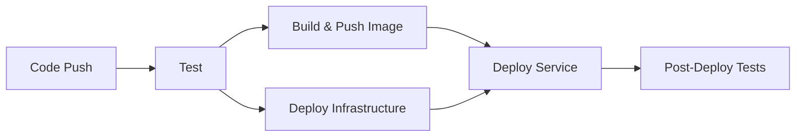

# Study Service CI/CD Guideline

## 📋 Overview

이 문서는 Study Service의 GitHub Actions를 이용한 CI/CD 파이프라인에 대한 가이드라인입니다.

## 🏗️ CI/CD Pipeline Architecture

### Pipeline Stages



### 1. **Test Stage**
- Java 코드 빌드 및 컴파일
- 단위 테스트 실행
- 테스트 결과 업로드

### 2. **Build & Push Stage** 
- Docker 이미지 빌드
- GitHub Container Registry에 푸시
- 태그: `latest`, `{commit-sha}`

### 3. **Deploy Infrastructure Stage**
- MySQL, Redis 인프라 배포
- 기존 컨테이너 확인 후 필요시에만 배포
- 헬스체크 수행

### 4. **Deploy Service Stage**
- Study Service 컨테이너 배포
- 기존 컨테이너 중지 및 새 버전 시작
- 헬스체크 및 상태 확인

### 5. **Post-Deploy Tests Stage**
- 배포 후 통합 테스트
- API 엔드포인트 동작 확인
- 서비스 상태 검증

## 🔧 Configuration

### Required GitHub Secrets

```yaml
SSH_PRIVATE_KEY: # 배포 서버 SSH 개인키 (base64 인코딩)
SSH_HOST: # 배포 서버 호스트
SSH_USER: # 배포 서버 사용자명
PAT_TOKEN: # GitHub Personal Access Token
```

### Environment Variables

```yaml
DOCKER_REGISTRY: ghcr.io
IMAGE_NAME: ghcr.io/asyncsite/study-service
SERVICE_NAME: study-service
SERVICE_PORT: 8083
```

## 🚀 Deployment Process

### Automatic Deployment Triggers

```yaml
# 자동 배포 트리거
- main 브랜치 푸시
- feature/** 브랜치 푸시
- fix/** 브랜치 푸시
- release/** 브랜치 푸시
- hotfix/** 브랜치 푸시
```

### Manual Deployment

GitHub Actions UI에서 `workflow_dispatch` 이벤트를 통해 수동 배포 가능:

1. GitHub Repository → Actions 탭
2. "Study Service CI/CD Pipeline" 선택
3. "Run workflow" 버튼 클릭

## 📊 Monitoring & Health Checks

### Health Check Endpoints

```bash
# 서비스 상태 확인
curl http://localhost:8083/actuator/health

# 상세 정보 확인
curl http://localhost:8083/actuator/info

# 메트릭 확인
curl http://localhost:8083/actuator/metrics
```

### Post-Deployment Tests

배포 완료 후 자동으로 실행되는 테스트:

1. **Health Check**: `/actuator/health` 엔드포인트 상태 확인
2. **API Test**: `/api/studies` 엔드포인트 동작 확인
3. **Container Status**: Docker 컨테이너 상태 검증

## 🐳 Docker Configuration

### Container Settings

```yaml
Container Name: asyncsite-study-service
Port Mapping: 8083:8083
Network: asyncsite-network
Restart Policy: unless-stopped
```

### Health Check

```yaml
Health Check:
  Command: curl -f http://localhost:8083/actuator/health
  Interval: 30s
  Timeout: 10s
  Retries: 3
  Start Period: 60s
```

## 🔄 Rollback Strategy

### Automatic Rollback

헬스체크 실패 시 자동으로 로그를 출력하고 배포 실패 처리:

```bash
# 헬스체크 실패 시
echo "❌ Health check failed after 10 attempts"
docker logs asyncsite-study-service --tail 50
exit 1
```

### Manual Rollback

```bash
# 이전 버전으로 롤백
docker pull ghcr.io/asyncsite/study-service:{previous-commit-sha}
docker stop asyncsite-study-service
docker rm asyncsite-study-service
docker run -d --name asyncsite-study-service \
  --network asyncsite-network \
  -p 8083:8083 \
  -e SPRING_PROFILES_ACTIVE=docker \
  ghcr.io/asyncsite/study-service:{previous-commit-sha}
```

## 📝 Infrastructure Management

### MySQL Database

```sql
-- 자동 생성되는 데이터베이스
CREATE DATABASE IF NOT EXISTS studydb 
CHARACTER SET utf8mb4 
COLLATE utf8mb4_unicode_ci;
```

### Redis Cache

```yaml
Container: asyncsite-redis
Image: redis:7-alpine
Port: 6379
Volume: asyncsite-redis-data
```

### Service Discovery

```yaml
Eureka Server: http://asyncsite-eureka:8761/eureka/
Service ID: study-service
Instance ID: ${HOSTNAME}:study-service:8083
```

## 🚨 Troubleshooting

### Common Issues

#### 1. Build Failure
```bash
# Gradle 빌드 실패 시 확인
./gradlew clean build --stacktrace --info
```

#### 2. Docker Image Push Failure
```bash
# GitHub Container Registry 로그인 확인
echo $GITHUB_TOKEN | docker login ghcr.io -u $GITHUB_ACTOR --password-stdin
```

#### 3. Deployment Failure
```bash
# 컨테이너 로그 확인
docker logs asyncsite-study-service --tail 100

# 네트워크 상태 확인
docker network ls | grep asyncsite-network
```

#### 4. Health Check Failure
```bash
# 수동 헬스체크
curl -v http://localhost:8083/actuator/health

# 응용 프로그램 로그 확인
docker logs asyncsite-study-service
```

### Debug Commands

```bash
# 컨테이너 상태 확인
docker ps | grep asyncsite

# 네트워크 확인
docker network inspect asyncsite-network

# 볼륨 확인
docker volume ls | grep asyncsite

# 서비스 로그 실시간 확인
docker logs -f asyncsite-study-service
```

## 📋 Best Practices

### Development Workflow

1. **Feature Branch**: `feature/issue-123/add-new-endpoint`
2. **Pull Request**: main 브랜치로 PR 생성
3. **CI Check**: PR에서 자동 빌드 및 테스트 실행
4. **Code Review**: 팀원 리뷰 완료
5. **Merge**: main 브랜치에 병합
6. **Auto Deploy**: main 브랜치 자동 배포

### Security Considerations

- SSH 키는 base64로 인코딩하여 시크릿에 저장
- 컨테이너는 non-root 사용자로 실행
- 네트워크는 내부 통신용으로 격리
- 환경변수로 민감한 정보 관리

### Performance Optimization

- Gradle 캐시 활용으로 빌드 시간 단축
- Docker Layer 캐시 최적화
- 병렬 빌드 및 테스트 실행
- 단계별 의존성 관리

## 📞 Support

문제 발생 시:

1. **GitHub Issues**: 버그 리포트 및 기능 요청
2. **Actions Logs**: GitHub Actions 실행 로그 확인
3. **Container Logs**: 서버에서 Docker 로그 확인
4. **Health Endpoints**: 서비스 상태 모니터링

---

> 이 문서는 Study Service의 CI/CD 파이프라인 운영을 위한 종합 가이드입니다. 
> 추가 질문이나 개선 사항이 있으면 팀에 문의해주세요.